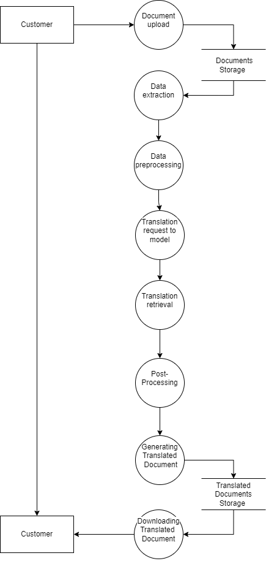
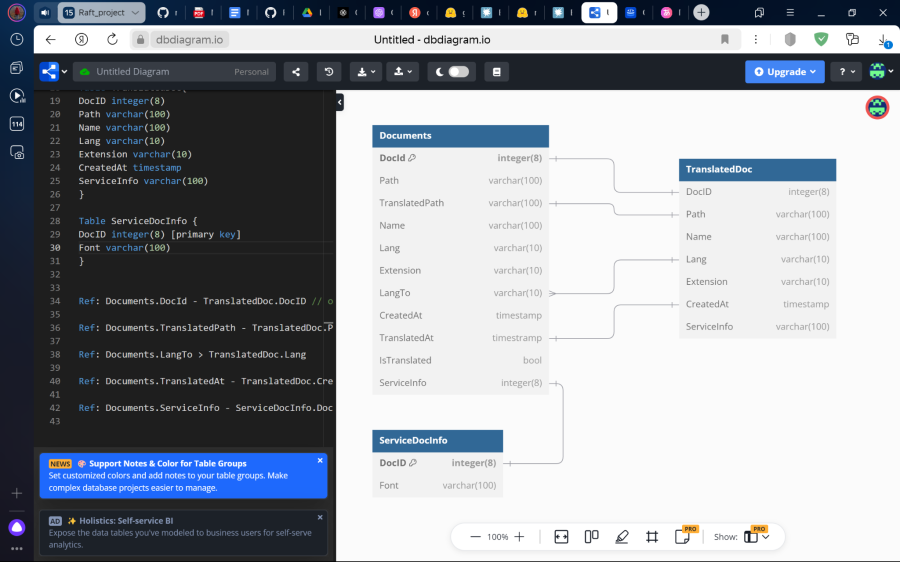
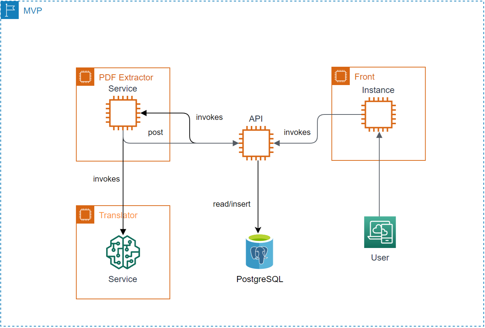

# Doc2Ru

<a target="_blank" href="https://cookiecutter-data-science.drivendata.org/">
    
</a>

This service translates any document on some language to Russian

# ML System Design Doc (Translator)

**Дизайн ML системы Doc2Ru**

## **1\. Цели и предпосылки**  
**1.1. Зачем идем в разработку продукта?**

### **Бизнес-цели**

*   Повышение скорости и качества анализа документов, представленных на иностранном языке
*   Обеспечение безопасности NDA данных
*   Автоматизация процесса перевода презентаций для сотрудников компании
*   Доступность в Российском регионе (не используются api иностранных сервисов, доступ к которым может быть ограничен)
*   Снижение издержек на перевод

### **Проблематика**

*   Большинство презентаций технического характера хранятся на английском языке
*   Временные и финансовые затраты на перевод презентаций
*   Обычные переводчики не всегда могут точно перевести технические термины
*   Сохранение формата переведенного элемента (таблица, граф)

### **Преимущества использования ИИ**

*   Быстрота перевода
*   Возможность обучения модели на специфических данных
*   Дешевизна перевода при больших объемах документов
*   Доступность без бюрократии

### **Критерии успеха**

*   Уменьшение времени на перевод презентаций на X%
    
*   Точность перевода технических терминов не менее X%
    
*   Если компания содержит штат переводчиков - сокращение затрат на его содержание: до 2-х специалистов в part-time
    
*   Если компания использует B2B решения для перевода документации, то снижение издержек на перевод: выделение бюджета на непредвиденные расходы для перевода, если система не дает должного качества
    

## **1.2. Бизнес-требования и ограничения**

### **Краткое описание бизнес-требований**

*   Разработка интуитивно понятного интерфейса для перевода презентаций 
*   Возможность работы с разными форматами файлов (.pptx, .pdf)
*   Обеспечение быстрого и качественного перевода текстов
*   Преобразование doc->doc с сохранением исходного форматирования
*   Безопасность данных

### **Бизнес-ограничения**

#### Разработка и тестирование LLM-моделей в контуре на одной 4090 в рамках сроков проекта

### **Итерации проекта**

*   #### Первая итерация (PoC)  
    Прототипирование основного функционала для демонстрации возможностей сервиса в Jupyter Notebooks
    
    *   #### Оценка временных затрат: 
        
        *   Извлечение текста из документов - библиотека для парсинга pdf и pptx (время реализации: около 7-14 дней на тестирование методов извлечения, интеграцию и проверку работы на разных типах файлов)
        *   Перевод текста с помощью LLM (время реализации: не более 7 дней). \[Обучение ограничится, скорее всего, prompt engineering'ом LLM или поиском лучшей модели\]
        *   Сохранение форматирования и метаданных (время реализации: проверка целостности переведенного документа — 7-14 дней )
        *   Первая итерация (PoC) займет примерно 4-6 недель с учетом возможных правок и тестирования
        
    *   **Описание датасета**: 
        *   Общая информация:  
            Датасет состоит из документов форматов PDF, каждый из которых представляет собой одностраничный файл (один слайд). В документах содержатся различные примеры текста на английском языке (различной степени формальности и назначения), изображения, таблицы и другие возможные элементы. 
        *   Количество записей - 15 - 20, обеспечивающих достаточный объем для тестирования различных сценариев.
        *   Типы контента:
            *   Основные текстовые фреймы
            *   Заголовки
            *   Текст в графических элементах (фигуры)
            *   Таблицы и формализованные данные
            *   Изображения

      *   Структура
            *   **id документа:** Уникальный идентификатор для каждого файла презентации.
            *   **Формат документа:** Указывает, является ли документ PDF.
            *   **Количество слайдов:** Общее количество слайдов в документе.
            *   **Язык на входе:** Основной язык, на котором написан текст в презентации (например, английский, русский, французский и т.д.).
            *   **Язык перевода:** Язык, на который необходимо перевести текст (например, русский, английский, испанский и т.д.).
            *   **Стиль текста:** Тип текста в документе — научный, формальный, неформальный, технический, рекламный и т.д.
            *   **Типы шрифтов:** Список шрифтов, использованных в презентации (например, Arial, Times New Roman, Roboto и т.д.).
            *   **Форматирование текста:** Информация о стилях форматирования текста (жирный, курсив, подчеркивание, цвет текста, размер шрифта).
            *   **Фреймы:** Типы фреймов, присутствующие на слайдах (текстовые, графические фреймы, фигуры, таблицы).
            *   **Тип таблиц:** Указывается, являются ли таблицы формализованными (с четкой структурой) или неформализованными (например, сканы).
            *   **Наличие изображений:** Информация о наличии и количестве изображений в презентации.

    *   **Ограничения данной итерации**:  
        Примечание: под фреймом понимается элементарная сущность-фигура, содержащая текст или без такового, с контуром или без
        *   Перевод текста, содержащегося в основных фреймах (фрейм текста, текст в фигурах, текст в заголовке)
        *   Преобразование всех шрифтов в простые (Times New Roman, Arial)
        *   Сохранение основных фреймов  (фрейм текста,  фигура, фрейм заголовка)
        *   Преобразование фреймов-фигур с контуром в простейший вид (прямоугольная прозрачная рамка с контуром)
        *   Преобразование стиля документа в простейший вид (белый фон)
        *   Перенос картинок в непереведенном виде
        *   Смена названия документа на его переведенное
        *   Перевод формализованных табличных данных (которые парсятся как язык разметки)
        *   Язык для перевода: английский, язык перевода: русский
    
    На данном этапе в качестве результата будет реализован ограниченный функционал для перевода и сохранения документов из тестового датасета
*   #### **Вторая итерация (MVP и тестирование)**
    

    *   #### Оценка временных затрат:
        
        *   Интеграция пользовательского интерфейса (FastAPI или Telegram Bot) — 7-14 дней
            
        *   Unit-тесты — около 7-10 дней
        *   Улучшение моделей перевода и оптимизация — 7-14 дней. (На этом этапе потребуется не только настройка LLM и prompt engineering, но и тестирование на более сложных документах с разнообразием шрифтов и фреймов)
        *   Вторая итерация (MVP и тестирование) займет примерно 4-6 недель с учетом возможных правок и тестирования
    *   **Основная концепция итерации**:
        *   Разработка MVP для тестирования в контролируемой среде и проведение нагрузочных тестов.
        *   ПО имеет пакетную структуру, имеются Unit-тесты, подтянут элементарный пользовательский интерфейс (FastAPI doc, например), позволяющий загрузить презентацию, выбрать язык для перевода, выгрузить преобразованную презентацию
        *   Unit-тесты с максимальным покрытием на основные функциональные модули.
    *   **Описание датасета**:
        *   Общая информация  
            В данной итерации датасет включает документы на различных языках, содержащие несколько слайдов (более одного слайда). В каждом слайде представлены разнообразные примеры текстов различных стилей аналогично датасету для PoС. Помимо разнообразия текстового контента, в файлах будут различные шрифты, стили оформления и фреймы, которые требует сохранения при переводе. 
        *   Количество записей 15 - 20
        *   Типы контента на документе аналогичны первой итерации
        *   Структура
            *   **id документа:** Уникальный идентификатор для каждого файла презентации.
            *   **Формат документа:** Указывает, является ли документ PDF.
            *   **Количество слайдов:** Общее количество слайдов в документе.
            *   **Язык на входе:** Основной язык, на котором написан текст в презентации (например, английский, русский, французский и т.д.).
            *   **Язык перевода:** Язык, на который необходимо перевести текст (например, русский, английский, испанский и т.д.).
            *   **Стиль текста:** Тип текста в документе — научный, формальный, неформальный, технический, рекламный и т.д.
            *   **Типы шрифтов:** Список шрифтов, использованных в презентации (например, Arial, Times New Roman, Roboto и т.д.).
            *   **Форматирование текста:** Информация о стилях форматирования текста (жирный, курсив, подчеркивание, цвет текста, размер шрифта).
            *   **Фреймы:** Типы фреймов, присутствующие на слайдах (текстовые, графические фреймы, фигуры, таблицы).
            *   **Тип таблиц:** Указывается, являются ли таблицы формализованными (с четкой структурой) или неформализованными (например, сканы).
            *   **Наличие изображений:** Информация о наличии изображений в презентации.

            | ID  | Формат | Кол-во слайдов | Язык на входе | Язык перевода | Стиль текста | Типы шрифтов | Форматирование | Фреймы | Тип таблиц | Наличие изображений |
            | --- | --- | --- | --- | --- | --- | --- | --- | --- | --- | --- |
            | 1   | PDF | 40  | Английский | Русский | Формальный, научно-аналитический | Arial | Жирный, курсив, разные размеры и цвета текста, заголовки | Текст, графические элементы | Неформализованные (отсутствует четкая структура) | Графические элементы и иконки |
            | 2   | PDF | 70  | Английский | Русский | Технический, формальный | Arial | Жирный, подчеркивание, разный размер и цвет текста, заголовки | Текст, графические элементы, диаграммы, таблицы | Формализованные (с четкой структурой) | Графические элементы, диаграммы, изображения |
            | 3   | PDF | 24  | Английский | Русский | Формальный, технический | Arial | Жирный, подчеркивание, разный размер текста, заголовки | Текст, графические элементы диаграммы | Формализованные | Диаграммы, графические элементы |
            | 4   | PDF | 24  | Английский | Русский | Научно-аналитический, деловой | Arial | Жирный, подчеркивание, разный размер текста, заголовки | Текст, графические элементы, диаграммы, таблицы, графики | Формализованные | Изображения, диаграммы, графики, графические элементы |
            | 5   | PDF | 40  | Английский | Русский | Научно-аналитический, деловой | Arial | Жирный, подчеркивание, заголовки, разный размер и цвет текста | Текст, графические элементы, диаграммы, таблицы | Формализованные | Графические элементы, диаграммы |
            | 6   | PDF | 10  | Английский | Русский | Академический, деловой | Arial | Жирный, подчеркивание, заголовки | Текст, блоки анализа | Нет | Нет |
            | 7   | PDF | 26  | Английский | Русский | Технический, академический | Arial | Жирный, заголовки, разный размер текста | Текст, диаграммы, графики, схемы | Нет | Графические элементы, схемы |
            | 8   | PDF | 22  | Английский | Русский | Деловой | Arial | Жирный, заголовки, разный размер текста | Текст, графики, схемы | Нет | Графические элементы, схемы |
            | 9   | PDF | 56  | Английский | Русский | Деловой | Arial | Жирный, подчеркивание, заголовки | Текст, изображения, графические элементы | Нет | Изображения, графические элементы, логотипы, скриншоты |
            | 10  | PDF | 12  | Английский | Русский | Академический | Arial | Жирный, заголовки | Текст, графические элементы | Нет | Графические элементы |
            

    *   **Ограничения данной итерации:**
        *   Перевод текста, содержащегося в >= 90% видов фреймов (отношение количества фреймов, которые можем обработать к общему количеству фреймов, переданных на обработку)
        *   Сохранение 70% всех видов шрифтов (та же методика), преобразование всех несохраняемых шрифтов в Times New Roman
        *   Сохранение 70% всех видов фреймов, преобразование всех несохраняемых фреймов в прямоугольную прозрачную рамку с контуром
        *   Сохранение 70% всех видов стилей документов, преобразование всех несохраняемых стилей в простейший вид (белый фон)
        *   Перенос картинок в непереведенном виде, создание поля комментария с переводом, содержащимся в картинке. Низкие требования к качеству.
        *   Перевод формализованных табличных данных.
        *   Извлечение неформализованных табличных данных (сканы) и сохранение в формализованном виде без перевода. Низкие требования к качеству.
        *   Язык для перевода: определяется автоматически, язык перевода: выбор нескольких языков
        *   Пользовательский интерфейс реализован в Fast API doc/Telegram bot
        *   В результате данной итерации будет реализовано MVP-решение, позволяющее пользователям с использованием простейшего пользовательского интерфейса переводить документы с одного языка на другой с сохранением исходных стилей  
            exit criteria:
        *   Успешное прохождение Unit-тестов
        *   Успешное прохождение нагрузочных тестов
        *   Есть реальная возможность перевести презентацию через элементарный пользовательский интерфейс
*   #### **Третья итерация (Микросервисная архитектура и автоматизация)**
    
    *   **Основная концепция итерации**:
        *   Перевод MVP в микро-сервисную архитектуру
        *   Внедрение практик проведения экспериментов (MLFlow, DVC)
        *   Подключение баз данных
        *   Создание CI\\CD пайплайна
        *   Создание Docker-образов систем
        *   Создание полноценного пользовательского интерфейса, написание UI-тестов  
            exit criteria:
        *   Интеграция базы данных и успешная работа CI/CD пайплайна.
        *   Docker-образы могут разворачиваться и работать в контейнерах без ошибок.
        *   UI проходит X% UI-тестов на основные функциональные элементы (загрузка, выбор языков, отображение переведенной презентации)
*   #### **Четвертая итерация (Производительность и поддержка)**
    
    *   #### **Основная концепция итерации**:
        
        *   Оценка производительности на реальных данных
        *   Отладка багов
        *   Доработка и сопровождение  
            exit criteria:
        *   Производительность: обработка реальных данных без значительных потерь в скорости и качестве на Х% презентаций.
        *   Все критические баги устранены, и система может стабильно работать в продакшн среде.

### **Описание бизнес-процесса пилота**

*   Интеграция и тестирование системы на выбранных платформах (Streamlit и т.п.)
*   Применение локальных LLM моделей для реализации целей проекта (LLaMa, Mistral and etc.)
*   Сбор и анализ обратной связи для последующих улучшений системы

### **Критерии успеха и возможные пути развития проекта**

*   Ускорение процесса перевода презентаций с английского языка на X%
*   Развитие: расширение набора языков для перевода, оптимизация алгоритмов, увеличение списка расширений документов, подаваемых для перевода

## **1.3. Что входит в скоуп проекта/итерации, что не входит**

*   ### **Что не будет закрыто:**
    

    *   Обработка большого количества расширений для документов
    *   Минимальные требования к безопасности, масштабируемости, производительности
*   ### **Описание результата с точки зрения качества кода и воспроизводимости решения:**
    
    *   #### Код
        
        *   Соответствие стандартам чистого кода и PEP8, использование Numpy/Google Docstring для документирования.
        *   Применение pre-commit-hooks для автоматической проверки кода RUFF.

    *   #### Все тесты в GitHub actions должны быть пройдены
        
        *   RUFF
        *   Успешная установка зависимостей через Poetry и сборка виртуального окружения.
        *   Отсутствие конфликтов среды и пакетов, корректная сборка Dockerfile.
        *   Проведение нагрузочных тестов и асинхронная работа кода, проверка функциональности Doc2Ru, подключения к API и работоспособности баз данных.
        *   Все изменения кода подвергаются code review перед слиянием в основную ветку.
    *   #### Последовательность проверки кода
        
        *   Выбора задачи в todoist
        *   Cоздания ветки в Git для этой задачи и ее выполнения
        *   Pull request в Main с коротким описанием изменений
        *   Код проверяет более опытный товарищ и после мерджит в Main или пишет какие коррективы стоит еще внести
        *   Задача закрывается как выполненная в todolist

*   ### **Описание планируемого технического долга (что оставляем для дальнейшей продуктивизации):**
    

    *   Рассмотрение возможности интеграции с дополнительными API, включая OpenAI, для улучшения функциональности и качества ответов.
    *   Исследование возможностей перевода для более широкого списка расширений файлов
    *   Интеграция других видов UI
*   ### **Что получит бизнес на каждой итерации проекта:**
    
    *   #### **Итерация 1 (PoC):**
        
        *   Cервис, который может переводить текстовые элементы в презентациях и сохранять форматирование (в упрощенном виде)
        *   Быстрый перевод документа с сохранением текстовых блоков, фигур, и картинок
        *   Бизнес сможет быстро оценить эффективность концепции и принять решение, стоит ли двигаться дальше. Получится проверить гипотезу: будет ли это решение полезным и точным для перевода презентаций
    *   #### **Итерация 2 (MVP):**
        
        *   Расширение функционала обработки фреймов (покрытие не менее 90% типов элементов в презентациях)
        *   Возможность выбирать язык для перевода и получать переведенные документы через простой пользовательский интерфейс (например, через FastAPI или Telegram bot)
        *   Улучшенные алгоритмы перевода, поддержка большего количества шрифтов и стилей
        *   Бизнес может начать интеграцию продукта в рабочие процессы компании и получать обратную связь от реальных пользователей
        *   Экономия времени и средств на перевод благодаря автоматизации, что позволяет проверить и измерить фактическую выгоду от использования системы
        *   Возможность постепенно сокращать штат переводчиков или оптимизировать использование внешних B2B-услуг по переводу
    *   **Итерация 3 (Микросервисная архитектура и автоматизация):**
        *   Бизнес получает стабильную и масштабируемую систему, готовую к работе в продакшене
        *   Подключение баз данных и реализация CI/CD пайплайнов для автоматического тестирования и деплоя обновлений (улучшенная поддержка и частые релизы без простоя)
        *   Полноценный пользовательский интерфейс, который позволяет не только загружать документы и получать переведенные версии, но и управлять настройками и параметрами перевода
        *   Возможность интеграции с другими бизнес-системами и платформами, что увеличивает гибкость продукта
    *   **Итерация 4 (Производительность и поддержка):**
        *   Бизнес получает зрелый продукт, готовый к масштабированию и использованию в повседневной деятельности
        *   Поддержка пользователей, устранение багов, и улучшение производительности для достижения максимальной скорости обработки документов
        *   Оценка производительности и дальнейшая оптимизация позволяют точно измерить экономический эффект и преимущества использования системы

## **1.4. Предпосылки решения**

### Для создания системы, которая отвечает на потребности бизнеса и пользователей, учитываем следующие предпосылки:

*   Появились сервисы для качественного извлечения структурных текстовых сущностей из документов формата \*.pdf (н-р, "PDF-Extract-Kit")
*   Появились действительно большие и высокопроизводительные open-source LLM, как мультимодальные: Llama 3.2 в разных конфигурациях, Mistral и т.д.; так и специализированные под задачу перевода: Google t5, и т.д.

## **2\. Методология**  
**2.1. Постановка задачи**

### Задача заключается в автоматизации процесса перевода документов и презентаций с одного языка на другой с сохранением оригинального форматирования, технической точности и структуры документов.

## **2.2. Блок-схема решения**

*   ### **Блок-схема будет включать следующие ключевые этапы:**
    
    *   Подготовка данных: извлечение текста из документов
    *   Разработка модели: Прототипирование и настройка LLM для решения задачи перевода текста.
    *   Оптимизация: Тонкая настройка и рефакторинг для улучшения точности и скорости ответов.
    *   Тестирование: Валидация системы на реальных документах и сбор обратной связи.
    *   Закрытие технического долга: Работа над известными проблемами и улучшение инфраструктуры.
    *   Подготовка пилота: Интеграция системы с тестовой базой данных и подключение пользовательского интерфейса


###  

## **2.3. Этапы решения задачи**

### При обращении к сервису выполняется добавление документа в базу данных PostgreSQL имеющей следующую структуру:



  
Рисунок 1 - Предлагаемая схема БД PostgreSQL.

*   Этап 1 – Подготовка данных: загрузка документа, извлечение текста, логическое разбиение текста документа, извлечение служебной информации из документа.
*   Этап 2 – Перевод текста документа: перевод логических элементов текста с языка на язык, формирование нового текста с сохранением логической структуры. Здесь в качестве моделей перевода можно брать как специализированные под эту задачу (типа google/t-5), либо LLM (типа meta-llama, NVLM, Mistral)
*   Этап 3 – Формирование документа: создание документа с форматом исходного, автоматическое наполнение документа с сохранением его логической структуры и служебных стилей
*   Этап 4 – Получение обратной связи: Оценка пользователем качества перевода. Это необходимо для оценки работы модели перевода и выбора направлений для улучшения качества выдачи.
*   Этап 5 – Адаптация модели: Добавление системы отслеживания метрик эффективности, формирование выборки параллельных текстов (возможно с применением автоматического перевода больших моделей перевода текстов - Yandex Translate, Google Translate) для оценки качества перевода.
*   Этап 6 – Формирование отчета: Описание используемых методов и параметров, достигнутых показателей эффективности, полученных данных для анализа и дальнейших доработок и улучшения.

**\* *Примечание: этапы формировались без предварительного EDA***

## **3\. Подготовка MVP**  
**3.1. Что считаем успешным MVP (cпособы оценки MVP)**

### Оценка эффективности будет проводиться на основе следующих параметров:

*   **Скорость обработки:** Перевод слайда занимает не более 10 секунд при обычной нагрузке (до 5 документов одновременно).
*   **Покрытие поддерживаемых фреймов:** Поддержка перевода и сохранения форматирования не менее 90% типов фреймов (текстовые блоки, фигуры, таблицы) из предоставленных на тестирование документов
*   **Поддержка шрифтов**: Сохранение исходных шрифтов в 70% случаев. Для остальных случаев — автоматическая конвертация в Times New Roman или другой стандартный шрифт.
    
*   **Интерфейс и взаимодействие**: Возможность загружать и выгружать презентации через FastAPI или Telegram Bot без ошибок и с корректным отображением переведенного текста.
*   **Точность перевода:** Уровень точности по метрикам BLEU/ROUGE не ниже 80% для технических и научных текстов.
*   **Успешная обработка слайдов**: Не менее 90%, информации со слайдов должно быть обработано
*   **Стабильная работа системы**: Система работает стабильно при различных нагрузках  
*   **Сохранение информации**: Объем информации в переведенном файле должен соответствовать объему информации в исходном файле (не менее X%)

## **3.2. Подготовка пилота**

*   **Анализ нагрузки:** оценка максимального количества документов, которые модель сможет обработать в реальном времени.
*   **Оценка ресурсов:** расчет необходимого объема вычислительных ресурсов для обработки пользовательских документов.
*   **Определение бюджета:** установление бюджета, доступного для проведения пилота, и соответствующего распределения ресурсов.
*   **Экспериментальные ограничения:** в случае ограниченных ресурсов, определение максимального количества пользователей, которое может быть включено в пилот.

## **4.1. Архитектура решения**



## **4.2. Описание инфраструктуры и масштабируемости**

### Сервер с GPU Nvidia 4090, VM = 24Gb

## **Project Organization**

```
├── LICENSE            <- Open-source license if one is chosen
├── Makefile           <- Makefile with convenience commands like `make data` or `make train`
├── README.md          <- The top-level README for developers using this project.
├── data
│   ├── external       <- Data from third party sources.
│   ├── interim        <- Intermediate data that has been transformed.
│   ├── processed      <- The final, canonical data sets for modeling.
│   └── raw            <- The original, immutable data dump.
│
├── docs               <- A default mkdocs project; see www.mkdocs.org for details
│
├── models             <- Trained and serialized models, model predictions, or model summaries
│
├── notebooks          <- Jupyter notebooks. Naming convention is a number (for ordering),
│                         the creator's initials, and a short `-` delimited description, e.g.
│                         `1.0-jqp-initial-data-exploration`.
│
├── pyproject.toml     <- Project configuration file with package metadata for 
│                         doc2ru and configuration for tools like black
│
├── references         <- Data dictionaries, manuals, and all other explanatory materials.
│
├── reports            <- Generated analysis as HTML, PDF, LaTeX, etc.
│   └── figures        <- Generated graphics and figures to be used in reporting
│
├── requirements.txt   <- The requirements file for reproducing the analysis environment, e.g.
│                         generated with `pip freeze > requirements.txt`
│
├── setup.cfg          <- Configuration file for flake8
│
└── doc2ru   <- Source code for use in this project.
    │
    ├── __init__.py             <- Makes doc2ru a Python module
    │
    ├── config.py               <- Store useful variables and configuration
    │
    ├── dataset.py              <- Scripts to download or generate data
    │
    ├── features.py             <- Code to create features for modeling
    │
    ├── modeling                
    │   ├── __init__.py 
    │   ├── predict.py          <- Code to run model inference with trained models          
    │   └── train.py            <- Code to train models
    │
    └── plots.py                <- Code to create visualizations
```

--------

